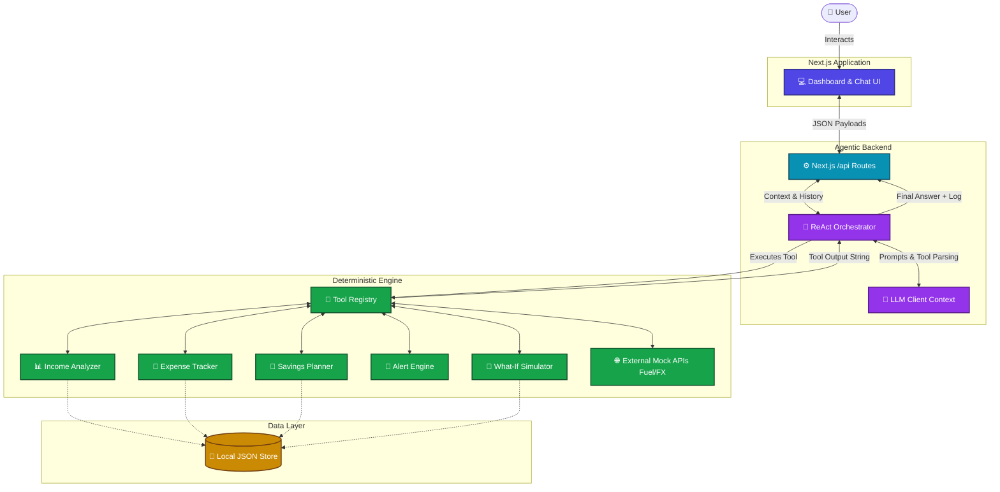

# FinanceMitra

*FinanceMitra — built for the people finance forgot.*

## 1. The Problem
Gig workers, freelancers, and daily-wage earners face highly irregular, unpredictable income streams that traditional budgeting tools cannot handle. Mainstream financial apps assume a fixed monthly salary and standard 30-day billing cycles, leaving independent workers without actionable advice when earnings fluctuate. They need dynamic savings plans, risk-aware forecasting, and proactive alerts tailored to high volatility.

## 2. What FinanceMitra Does
- **Dynamic Savings Planning**: Calculates realistic savings intervals based on actual surplus and adjusts recommendations for projected slow vs. good months.
- **Proactive Risk Warnings**: Automatically alerts users if they are entering a slow season, if an expense spike exceeds their weekly average dangerously, or if they are tracking behind on vital goals.
- **Volatility-Aware Forecasting**: Provides low, mid, and high expected income ranges using weighted rolling historical averages.
- **Conversational Guidance**: Provides warm, localized, jargon-free support grounded by deterministic data bounds over a conversational interface.

## 3. Architecture Overview
FinanceMitra utilizes a ReAct pattern based loosely on the **Perception → Brain → Action** pipeline inspired by FinRobot. Data ingestion and UI (Perception) are heavily decoupled from the Agent Orchestrator (Brain), which iterates via the AI Model through deterministic functional modules (Action).
To enforce absolute mathematical strictness on financial computations, the LLM itself evaluates zero financial algorithms. All computation (income trends, volatility, surpluses) scales via typed Typescript interfaces ensuring zero LLM hallucination over sensitive figures.



## 3b. Updated Architecture

```mermaid
graph TD
    classDef ui fill:#4f46e5,stroke:#312e81,stroke-width:2px,color:#fff;
    classDef api fill:#0891b2,stroke:#164e63,stroke-width:2px,color:#fff;
    classDef brain fill:#9333ea,stroke:#581c87,stroke-width:2px,color:#fff;
    classDef tool fill:#16a34a,stroke:#14532d,stroke-width:2px,color:#fff;
    classDef db fill:#ca8a04,stroke:#713f12,stroke-width:2px,color:#fff;
    classDef memory fill:#ea580c,stroke:#7c2d12,stroke-width:2px,color:#fff;

    User([👤 User]) -->|Interacts| UI

    subgraph Frontend [Next.js Application]
        UI[💻 Dashboard]:::ui
        Chat[💬 Chat]:::ui
        CreditPage[📋 Credit Narrative]:::ui
        PatternPage[🔍 Pattern Agent]:::ui
    end

    subgraph APILayer [API Layer]
        API[⚙️ Next.js /api Routes]:::api
    end

    subgraph AgenticBackend [Agentic Backend]
        Orch[🧠 ReAct Orchestrator]:::brain
        LLM[🤖 Qwen - AWS Bedrock]:::brain
        PA[🔍 Pattern Agent]:::brain
        CN[📋 Credit Narrative]:::brain
    end

    subgraph DeterministicEngine [Deterministic Engine]
        TR[🔧 Tool Registry]:::tool
        subgraph CoreTools [Core Financial]
            IA[📊 Income Analyzer]:::tool
            ET[💸 Expense Tracker]:::tool
            SP[🎯 Savings Planner]:::tool
            AE[🚨 Alert Engine]:::tool
        end
        subgraph AdvisoryTools [Advisory]
            Sim[🔮 What-If Simulator]:::tool
            SC[⚖️ Scenario Comparison]:::tool
            TAX[🧾 Tax Advisor]:::tool
            FUEL[⛽ Fuel Price]:::tool
        end
    end

    subgraph SideLayer [Memory, Knowledge and Supporting Engines]
        KB[📚 Knowledge Base]:::memory
        SS[🗄️ Session Store]:::memory
        SAE[🚨 Smart Alerts]:::tool
        WD[📅 Weekly Digest]:::tool
        BP[🏦 Banking Personalizer]:::tool
    end

    subgraph DataLayer [Data Layer]
        DB[(📁 JSON Store)]:::db
        SQLite[(🗄️ sessions.db)]:::db
    end

    UI <-->|JSON Payloads| API
    Chat <-->|JSON Payloads| API
    CreditPage <-->|JSON Payloads| API
    PatternPage <-->|JSON Payloads| API

    API <-->|Context and History| Orch
    API <-->|Pattern Queries| PA
    API -->|Credit Request| CN
    API --> SAE
    API --> WD
    API --> BP

    Orch <-->|Prompts and Tool Parsing| LLM
    PA <-->|Prompts| LLM
    CN <-->|Prompts| LLM

    Orch -->|Executes Tool| TR
    TR <--> IA
    TR <--> ET
    TR <--> SP
    TR <--> AE
    TR <--> Sim
    TR <--> SC
    TR <--> TAX
    TR <--> FUEL

    Orch <--> KB
    Orch <--> SS

    TR -->|Tool Output| Orch
    Orch -->|Final Answer + Log| API

    IA -.-> DB
    ET -.-> DB
    SP -.-> DB
    Sim -.-> DB
    SAE -.-> DB
    WD -.-> DB
    SS -.-> SQLite
```



## 4. The Agent's Toolkit

| Tool Name | Purpose | Type |
|---|---|---|
| `income_analyzer` | Tracks rolling income averages, volatility score, and best earning periods. | Deterministic |
| `expense_tracker` | Categorizes spend automatically mapping fixed vs variable expenses and detecting unusual spikes. | Deterministic |
| `savings_planner` | Adjusts targeted savings against realistic projections allowing for high/low earning flexibility. | Deterministic |
| `income_forecaster` | Forecasts next week/month earnings with probability ranges. | Deterministic |
| `alert_engine` | Triggers urgent warnings around low surpluses, fast approaching rent, or trailing emergency funds. | Deterministic |
| `what_if_simulator` | Simulates the financial impact of a hypothetical change — extra saving, expense cut, income shift, or goal change. | Deterministic |
| `compare_scenarios` | Compares two financial paths side-by-side (EMI vs save-up) and returns a verdict with risk rating. | Deterministic |
| `tax_advisor` | Computes tax position using actual transactions — 44ADA eligibility, advance tax, regime choice, ITR form, and TDS. Grounded via RAG. | Deterministic + RAG |
| `fetch_fuel_price` | Fetches current petrol price for the user's city and computes monthly budget impact for drivers. | External Mock API |
| `fetch_exchange_rate` | Fetches current INR exchange rate and timing signal for freelancers deciding when to receive foreign payments. | External Mock API |

## 5. How to Run
1. `npm install`
2. Add `.env.local` containing `ANTHROPIC_API_KEY="your_api_key_here"`
3. `npm run dev`

## 6. Guardrails
1. **Deterministic-first**: Every number in the agent's response comes from the core engine, not the LLM.
2. **JSON-only tool decisions**: The orchestrator prompts Claude to respond in strict JSON for deterministic tool matching.
3. **Hard financial limits**: Encoded limits block saving targets > 50% of income or hazardous variable loan rates.
4. **RAG grounding**: Advice is strictly grounded in the curated knowledge base of 20 verified gig-worker rules.
5. **Max iterations cap**: The ReAct loop caps tightly at 5 continuous calls.
6. **No PII in logs**: The reasoning logger strips personal traces, maintaining isolated IDs.
7. **Savings-and-budgeting scope lock**: Rejects giving investment, trading, or insurance product advice.

## 7. Assumptions
- This MVP features deterministic engine routines wired to heavily analyzed, realistic offline mocked data spanning exactly 90 days.
- Designed in INR but computationally currency-agnostic. No external database dependency (relies on internal caches).

## 8. Demo Users

| User Profile | Archetype | Key Income Pattern |
|---|---|---|
| Ravi Kumar | Ride Share Driver | `weekend_heavy` (High Fri/Sat, Zero Sun) |
| Priya Mehta | Freelance Designer | `lumpy_monthly` (1-2 big isolated checks) |
| Selvam Arasan | Street Food Vendor | `daily_cash` (Consistent except Mon) |
| Meena Joshi | Part-time Multi-job | `biweekly_mixed` (Reliable 1st/15th with gig flex) |

## 9. Reasoning Log Sample

```text
┌─ FinanceMitra Reasoning Log ──────────────────────────────────────────┐
│ Session: abc123 · User: Ravi Kumar · 14:32:05                         │
├───────────────────────────────────────────────────────────────────────┤
│ Step 1 · THINK                                                        │
│ User asked: "Can I afford a ₹3,000 EMI loan?"                        │
│ Thought: Need income data and expense data before I can answer this.  │
│ Decision: Call income_analyzer                                         │
├───────────────────────────────────────────────────────────────────────┤
│ Step 2 · ACT → income_analyzer (period: 90d)                          │
│ Result: Avg monthly ₹18,400 | Volatility: 34 | Worst month: ₹12,100  │
├───────────────────────────────────────────────────────────────────────┤
│ Step 3 · THINK                                                        │
│ Thought: Have income. Need expense data to find actual surplus.        │
│ Decision: Call expense_tracker                                         │
├───────────────────────────────────────────────────────────────────────┤
│ Step 4 · ACT → expense_tracker (period: 90d)                          │
│ Result: Fixed expenses ₹11,000/mo | Variable ₹4,200/mo | Trend: stable│
├───────────────────────────────────────────────────────────────────────┤
│ Step 5 · THINK                                                        │
│ Thought: Surplus = ₹18,400 - ₹15,200 = ₹3,200. EMI = ₹3,000.        │
│          In worst month: ₹12,100 - ₹15,200 = -₹1,100 deficit.        │
│          EMI is dangerous on variable income. Recommending caution.   │
│ Decision: Final answer                                                 │
└───────────────────────────────────────────────────────────────────────┘
```
